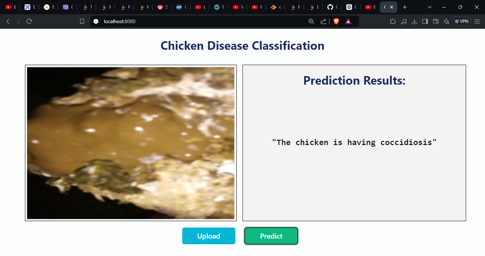

# Chicken Disease Classification

## Overview
The Chicken Disease Classification Project aims to detect and classify poultry diseases using a deep learning-based Convolutional Neural Network (CNN) model. This project automates the identification of chicken diseases from images, improving diagnostic accuracy and efficiency in the poultry farming industry.

## Demo 

<div>
    
    
</div>

You can find the deployed link to the project here: 730335524291.dkr.ecr.ap-south-1.amazonaws.com

(I have terminated this for now due to the high computing cost incurred in running this application.)

## Key Features
Automated disease detection using CNN models.
High accuracy of over 90% for classifying chicken diseases.
Cloud deployment using AWS or Azure for real-time accessibility.
Integrated CI/CD pipeline for continuous integration and deployment.
Comprehensive data preprocessing and model evaluation techniques.


## Tech Stack
Python
TensorFlow/Keras for deep learning model development
Scikit-learn for data preprocessing and model evaluation
AWS/Azure for cloud deployment
CI/CD pipeline using GitHub Actions

## Workflows
1. Update config.yaml
2. Update secrets.yaml [Optional]
3. Update params.yaml
4. Update the entity
5. Update the configuration manager in src config
6. Update the components
7. Update the pipeline
8. Update the main.py
9. Update the dvc.yaml

## How to run?
### STEPS:

Clone the repository

```bash
https://github.com/Lucifer0807/chicken-disease-classification--Project
```
### STEP 01- Create a conda environment after opening the repository

```bash
conda create -n cnncls python=3.12 -y
```

```bash
conda activate cnncls
```


### STEP 02- install the requirements
```bash
pip install -r requirements.txt
```


```bash
# Finally run the following command
python app.py
```

Now,
```bash
open up you local host and port
```


### DVC cmd

1. dvc init
2. dvc repro
3. dvc dag


# AWS-CICD-Deployment-with-Github-Actions

## 1. Login to AWS console.

## 2. Create IAM user for deployment

	#with specific access

	1. EC2 access : It is virtual machine

	2. ECR: Elastic Container registry to save your docker image in aws


	#Description: About the deployment

	1. Build docker image of the source code

	2. Push your docker image to ECR

	3. Launch Your EC2 

	4. Pull Your image from ECR in EC2

	5. Lauch your docker image in EC2

	#Policy:

	1. AmazonEC2ContainerRegistryFullAccess

	2. AmazonEC2FullAccess

	
## 3. Create ECR repo to store/save docker image
    - Save the URI: 730335524291.dkr.ecr.ap-south-1.amazonaws.com/chicken

	
## 4. Create EC2 machine (Ubuntu) 

## 5. Open EC2 and Install docker in EC2 Machine:
	
	
	#optinal

	sudo apt-get update -y

	sudo apt-get upgrade
	
	#required

	curl -fsSL https://get.docker.com -o get-docker.sh

	sudo sh get-docker.sh

	sudo usermod -aG docker ubuntu

	newgrp docker
	
# 6. Configure EC2 as self-hosted runner:
    setting>actions>runner>new self hosted runner> choose os> then run command one by one


# 7. Setup github secrets:

    AWS_ACCESS_KEY_ID=

    AWS_SECRET_ACCESS_KEY=

    AWS_REGION = us-east-1

    AWS_ECR_LOGIN_URI = demo>>  730335524291.dkr.ecr.ap-south-1.amazonaws.com

    ECR_REPOSITORY_NAME = simple-app

## Azure CI/CD deployment with GitHub Actions 

Save the password generated under Access keys in your container registry somewhere safe.
You can only see the password after enabling Admin user in Access keys.

### Run from terminal one by one:

```bash
docker build -t <login_server>/<your_project_name>:<tag> .
docker login <login_server>
docker push <login_server>/<your_project_name>:<tag>
```

### Deployment Steps:

1. Build the Docker image of the Source Code
2. Push the Docker image to Container Registry
3. Launch the Web App Server in Azure 
4. Pull the Docker image from the container registry to Web App server and run


